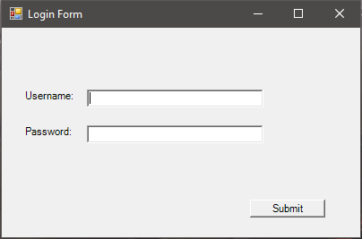
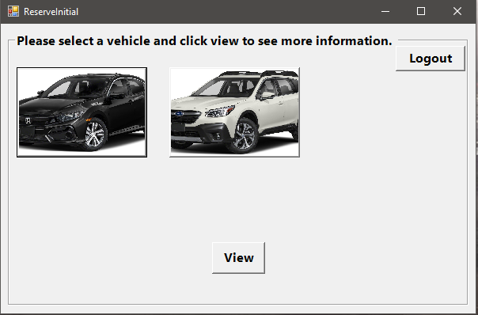
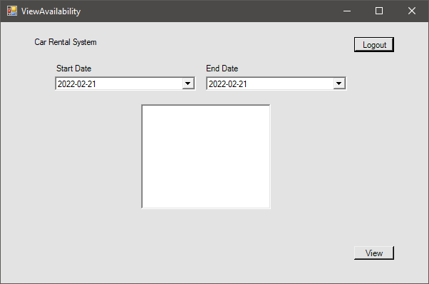

<h1><b> Car Rental System </b></h1>

 CSCI 4711 Fall 2021 Project

<b><u>Group Members:</u></b>
<ul>
    <li><a href="https://github.com/ahall1315" target="_blank">ahall1315</a></li>
    <li><a href="https://github.com/BMcclammy99" target="_blank">BMcclammy99</a></li>
    <li><a href="https://github.com/jparker2049" target="_blank">jparker2049</a></li>
    <li><a href="https://github.com/SebGonzal" target="_blank">SebGonzal</a></li>
</ul>

<h2><b><u>Description:</u></b></h2>

<b>About</b>

Car Rental System is an application that provides a system to make reservations from a selection of vehicles, and to monitor the availability of the fleet.

Car Rental System was also a group project in Software Engineering at Augusta University.

<b>Features</b>

<ul>
    <li>Tracks information about a number of preset vehicles and their availability</li>
    <li>Stores information in a database</li>
    <li>Customers can make reservations for vehicles</li>
    <li>Employees can view the availability of the vehicles</li> 
</ul>

<b>User Credentials</b>

Customer Username: cus 
Customer Password: 1qaz

Employee Username: emp 
Employee Password: 2wsx

 
 

 
 

